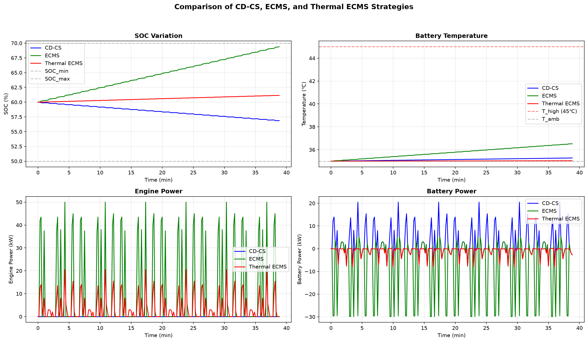

# PHEV 能量管理与热管理协同控制

面向 CLTC-P 工况，我完成了 PHEV 动力系统建模、能量管理策略设计、热约束控制、参数寻优和动态规划基准验证，形成了从需求功率计算到策略评价的完整仿真流程。

## 我完成的工作

- 建立整车纵向动力学模型，根据车速、加速度、滚阻、风阻和坡度计算需求功率。
- 建立发动机燃油消耗、电机效率、电池 SOC 与电池一阶热模型。
- 实现 CD-CS、ECMS 和 Thermal ECMS 三种在线能量管理策略。
- 在 ECMS 瞬时等效油耗中加入电池温度惩罚项，使功率分配同时考虑经济性与温升。
- 扫描等效因子、SOC 反馈系数和温度惩罚权重，寻找综合性能更好的参数组合。
- 建立动态规划模型，通过状态、控制量离散和逆向求解获得全局优化基准，用于评价 Thermal ECMS。
- 统一计算燃油消耗、电耗、冷却能耗、综合油耗、终端 SOC、最高温度和温度越界时间。

## 控制策略

| 策略 | 核心设计 |
| --- | --- |
| CD-CS | 按 SOC 阈值在纯电消耗与电量维持阶段之间切换 |
| ECMS | 将电能消耗折算为等效燃油，在每个时刻优化发动机与电池功率分配 |
| Thermal ECMS | 在 ECMS 目标函数中加入温度惩罚，抑制高温状态下的电池负荷 |
| DP | 以 SOC 和温度为状态、发动机功率为控制量，逆向求解全局最优轨迹 |

## 仿真结果

默认对比工况：30 个 CLTC-P 循环、环境温度 35 ℃、初始 SOC 0.60，ECMS 等效因子 `s=1.6`，温度惩罚权重 `w_T=5.0`。

| 策略 | 综合油耗 (L/100 km) | 终端 SOC | 最高温度 (℃) |
| --- | ---: | ---: | ---: |
| CD-CS | 7.05 | 0.569 | 35.3 |
| ECMS | 22.32 | 0.694 | 36.5 |
| Thermal ECMS | 14.09 | 0.612 | 35.0 |

对比结果展示了三种策略下的 SOC、电池温度、发动机功率和电池功率轨迹。Thermal ECMS 在当前参数下将最高电池温度控制在 35.0 ℃，同时使终端 SOC 更接近初始设定。

## 核心代码

| 文件 | 实现内容 |
| --- | --- |
| `1、m温度n个全CLTC-P工况循环CD-CS（有图）(1).py` | 25 ℃环境下的 CD-CS 仿真 |
| `1、m温度n个全CLTC-P工况循环CD-CS（有图）(2).py` | 35 ℃环境下的 CD-CS 仿真 |
| `2-1、m温度n个全CLTC-P工况循环双SOC - 普通ECMS.py` | 不同初始 SOC 下的 ECMS 仿真 |
| `2-2 最优组合.py` | A-ECMS 参数组合扫描与寻优 |
| `3-2、策略对比.py` | CD-CS、ECMS 与 Thermal ECMS 统一对比 |
| `4、 DP热约束ECMS评估.py` | DP 全局优化及 Thermal ECMS 评价 |
| `课程设计报告-张容-2023213357.pdf` | 模型、控制方法和结果的完整说明 |

## 技术栈

Python、NumPy、pandas、SciPy、Matplotlib。

## 作者

张容｜智能车辆工程｜2026 年 7 月
